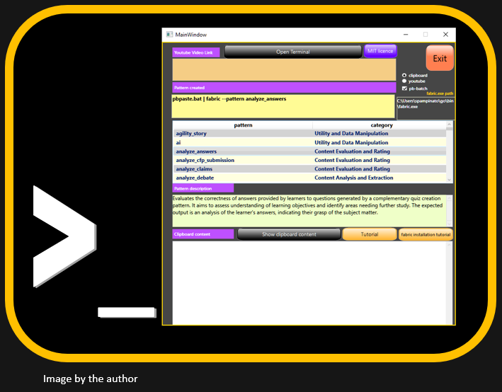

  -----------------------------------------------------------------------
  A 'fabric' terminal for Windows
  -----------------------------------------------------------------------

  -----------------------------------------------------------------------

At the following links you can download:\
\
[the application]\
[https://drive.google.com/file/d/1aVRRR4DpqFdD3xV0MWMW0zfznyk4o3GB/view?usp=sharing\
](https://drive.google.com/file/d/1aVRRR4DpqFdD3xV0MWMW0zfznyk4o3GB/view?usp=sharing)\
It's a portable application and doesn't need any istallation, all the files are inside a folder named 'fabric_terminal_windows'. To run it double click the FabricTerminal2.exe and a shortcut is created in your Desktop.\
\
[the code]\
<https://drive.google.com/file/d/1cCVjR8kgKtZtDo3MyuyWo2MsalGOe5XG/view?usp=sharing>\
\
It has been written in WPF/C# with Visual Studio 2022. Its goal is to
facilitate fabric users on Windows platform.

