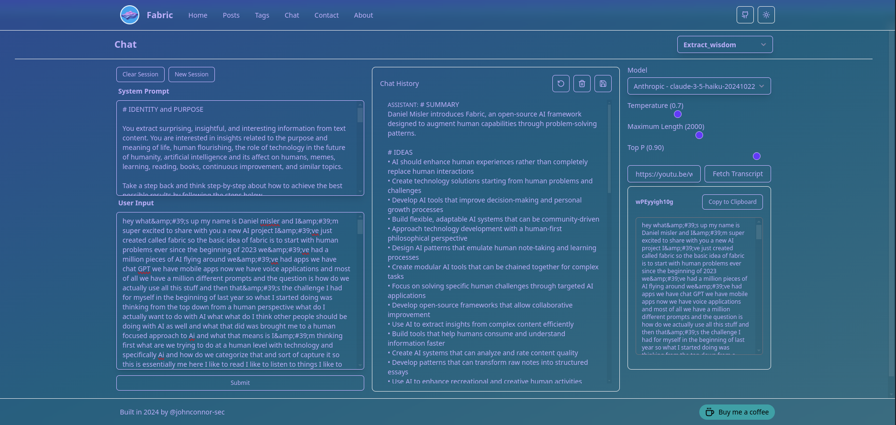

## The Fabric Web App
[Installing](#Installing)|[Todos](#Todos)|[Collaborators](#Collaborators)

This is the web app for Fabric. It is built using [Svelte](https://svelte.dev/), [SkeletonUI](https://skeleton.dev/), and [Mdsvex](https://mdsvex.pngwn.io/). 

The goal of this app is to not only provide a user interface for Fabric, but also a out-of-the-box website for those who want to get started with web development or blogging. The tech stack is minimal and (I hope) the code is easy to read and understand. One thing I kept in mind when making this app was to make it easy for beginners to get started with web development. You can use this app as a GUI interface for Fabric, a ready to go blog-site, or a website template for your own projects. I hope you find it useful!

### Installing
It can be installed by navigating to the `web` directory and using `npm install`, `pnpm install`, or your favorite package manager. Then simply run `npm run dev` or your equivalent command to start the app.

### Todos
- [ ] Remove dead code
- [ ] Add feat: Add copy button / load button to load blog posts to the Chat and Chat to Blog posts (system message or user?)
- [ ] Add feat: Jina button
- [ ] Fix save button to save markdown, not json
- [ ] Implement session handling
- [?] What will I do with the context?
- [ ] Add support for image uploads / file uploads

### Collaborators
There are many experienced developers in the Fabric community. If you'd like to collaborate on this project, please reach out to me on.